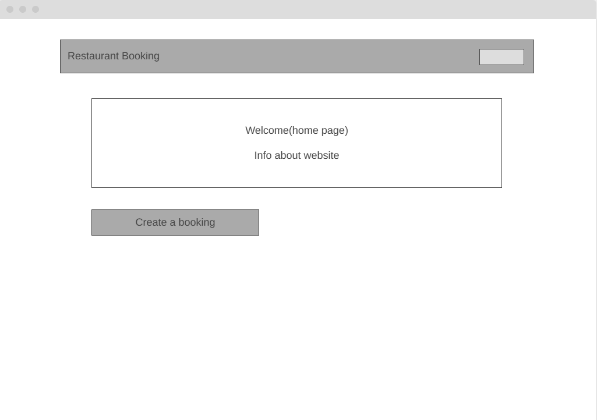
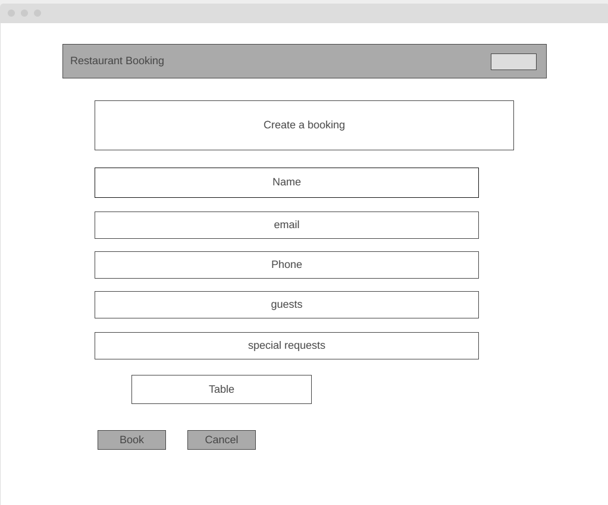
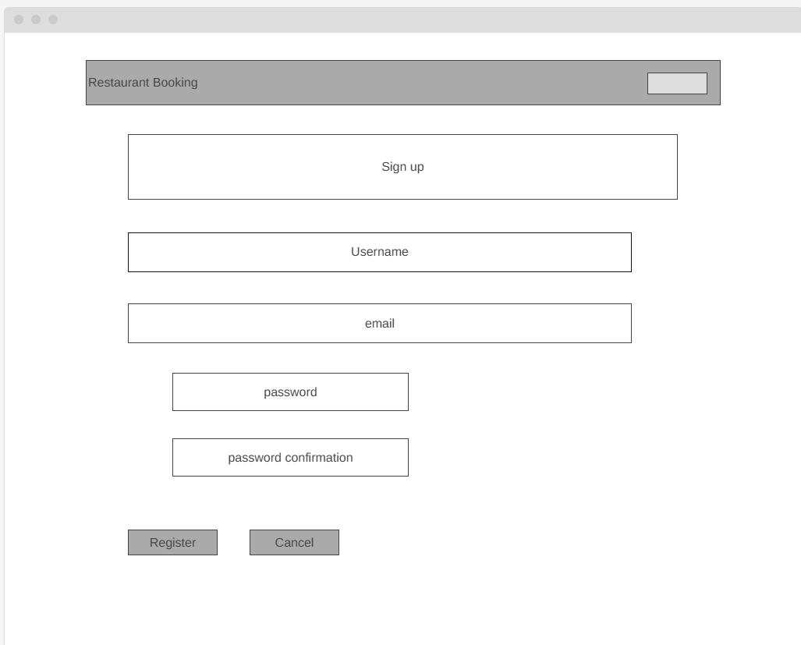
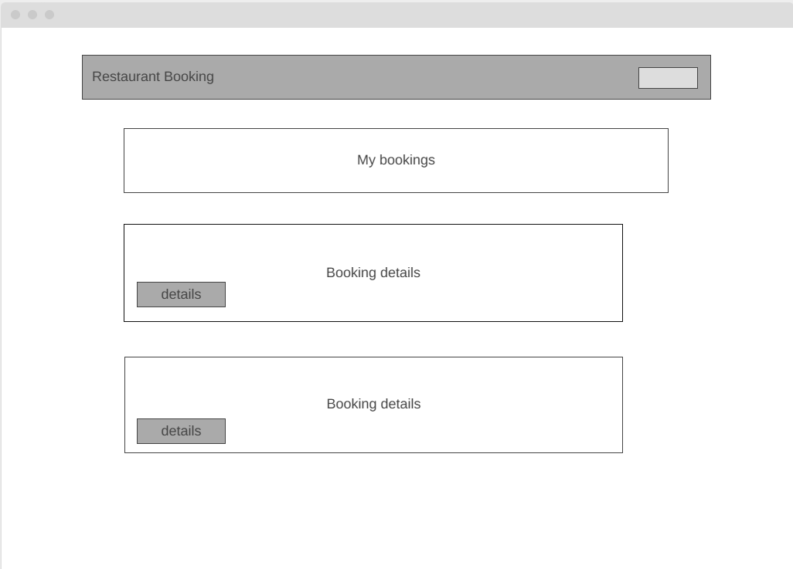
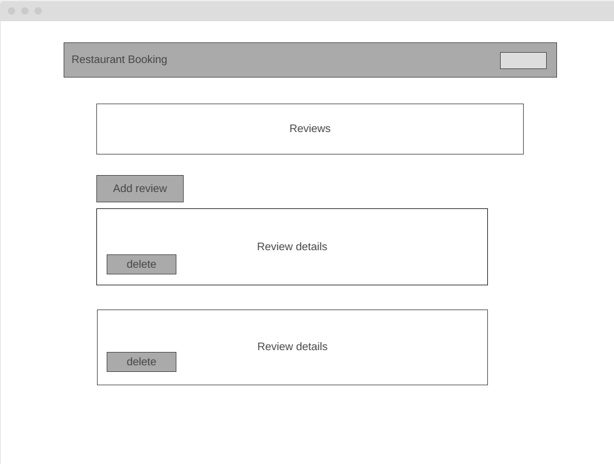

# Restaurant Booking System

### GitHub Repository

You can find the source code for this project in the GitHub repository:

[**GitHub Repository**](https://github.com/johnfurlong98/restaurant-booking-submission)


A Django-based web application allowing customers to:
- Register, log in, and log out
- Create, view, update, and delete restaurant bookings
- View, add, and delete reviews (custom second model)
- Receive immediate feedback messages on all CRUD operations

## Table of Contents
1. [Project Purpose](#project-purpose)
2. [Features](#features)
3. [User Stories](#user-stories)
4. [Project Structure](#project-structure)
5. [Wireframes](#wireframes)
6. [Agile Approach](#agile-approach)
7. [Technologies](#technologies)
8. [Data Models](#data-models)
9. [Testing](#testing)
10. [Manual Testing](#manual-testing)
11. [Deployment](#deployment)
12. [Known Issues and Future Improvements](#known-issues-and-future-improvements)
13. [Credits](#credits)

---

## Project Purpose
- **External Users**: Quickly book a table and provide feedback/review.
- **Restaurant Owner**: Manage bookings & see user reviews in real-time.

## Features
1. **User Registration & Auth**: Based on Django's built-in system.
2. **CRUD Bookings**: Create, read, update, delete booking records from the front-end.
3. **CRUD Reviews**: Create & delete simple reviews about the restaurant.
4. **Bootstrap**-styled templates with responsive design.
5. **Success/Failure** messages for user feedback.
6. **Interactive UI Components**:
   - Dynamic carousel on homepage
   - Responsive navigation
   - FAQ accordion
   - Review cards with star ratings
7. **Form Validation**: Client and server-side validation for all forms
8. **Admin Dashboard**: Custom admin interface for managing bookings and reviews

## Project Structure

```
restaurant-booking/
├── reservations/
│   ├── static/
│   │   └── css/
│   │       └── style.css
│   │
│   ├── templates/
│   │   └── reservations/
│   │       ├── base.html
│   │       ├── home.html
│   │       ├── booking_create.html
│   │       ├── booking_update.html
│   │       ├── menu.html
│   │       └── ...
│   │
│   ├── tests/
│   │   ├── test_forms.py
│   │   ├── test_models.py
│   │   ├── test_urls.py
│   │   └── test_views.py
│   │
│   ├── models.py
│   │
│   ├── views.py
│   │
│   └── urls.py
│
├── static/
│   └── css/
│       └── style.css
│
├── templates/
│   └── base.html
│
└── manage.py
```

## User Stories
- "As a new visitor, I can register an account so that I can log in and create a booking."
- "As a logged-in user, I can create a booking so that I can reserve a table."
- "As a logged-in user, I can edit or cancel my booking if my plans change."
- "As any user, I can leave a quick review so that I can share my experience with others."
- "As an admin, I can access the admin panel to manage everything behind the scenes."

## Wireframes

### Overview

This section provides an overview of the wireframes for the **Restaurant Booking System**. Wireframes are essential for visualizing the layout, structure, and user interactions within the application. Below are the key wireframes that outline the primary screens and their functionalities. The login page was not planned in wireframes as I used a very basic standard login design.

### Wireframes Overview

- **Homepage**
- **Booking Creation**
- **User Signup**
- **My Booking**
- **Reviews Page**

### Wireframe Screens

#### 1. Homepage



**Description:**
The homepage serves as the entry point for users. It features the navigation bar with links to key sections such as "Create a Booking," "Reviews," "Login," and "Sign Up." The main area highlights the restaurant's offerings and includes a call-to-action button for creating a new booking.

**Key Elements:**
- Navigation Bar
- Hero Section with Call-to-Action
- Overview of Services

---

#### 2. Booking Creation



**Description:**
This screen allows users to create a new booking. The form includes fields for name, email, phone number, reservation date, number of guests, special requests, and table selection. Validation messages ensure users provide the necessary information.

**Key Elements:**
- Booking Form
- Input Fields with Labels
- Submit and Cancel Buttons
- Optional Table Selection Dropdown

---

#### 3. User Signup



**Description:**
The registration page enables new users to sign up for an account. It includes fields for username, email, password, and password confirmation. Clear instructions and validation feedback guide users through the registration process.

**Key Elements:**
- Registration Form
- Input Fields with Labels
- Password Requirements
- Register and Cancel Buttons

---

#### 4. My Booking 



**Description:**
After logging in, users can view a list of their existing bookings. Each booking entry displays key details and provides options to view, edit, or cancel the booking.

**Key Elements:**
- List of Bookings
- Booking Details (Name, Date, Guests, etc.)
- Action Buttons (View, Edit, Cancel)

---

#### 5. Reviews Page



**Description:**
The reviews page showcases feedback from customers. Users can read existing reviews and, if logged in, submit their own. The layout ensures readability and easy navigation through different reviews.

**Key Elements:**
- List of Customer Reviews
- Review Submission Form
- Pagination or Scroll for Multiple Reviews

### How to Use These Wireframes

1. **Reference During Development:** Use these wireframes as a blueprint to guide the development of each page, ensuring consistency and alignment with the initial design vision.
2. **User Feedback:** Share wireframes with stakeholders or potential users to gather feedback and make iterative improvements before full-scale development.
3. **Design Iterations:** Update wireframes as the project evolves to reflect changes in functionality or design preferences.

### Tools Used for Wireframing

- **wireframe.cc:** For creating interactive and collaborative wireframes.

## Agile Approach
- We used a [GitHub Project Board](https://github.com/USERNAME/improved_restaurant_booking/projects/1) with Epics (Bookings, Reviews, Deployment), user stories, and tasks.
- Tasks are broken down into sub-issues or checklists inside stories.

## Technologies
- Django 4.2.11
- Python 3.9.21
- Bootstrap 5 (CDN)
- Bootstrap Icons
- Gunicorn (production server)
- SQLite (dev)
- Heroku (deployment)
- Jest & Puppeteer (E2E testing)
- pytest (Python testing)

## Data Models
1. **Booking**: 
   - id (AutoField)
   - user (ForeignKey to User)
   - name (CharField)
   - email (EmailField)
   - phone (CharField)
   - reservation_date (DateTimeField)
   - number_of_guests (IntegerField)
   - special_requests (TextField)
   - created_on (DateTimeField)

2. **Review**: 
   - id (AutoField)
   - user (ForeignKey to User)
   - title (CharField)
   - content (TextField)
   - rating (IntegerField)
   - created_on (DateTimeField)

## Testing

### Django Automated Tests (pytest)

The project includes comprehensive automated tests using pytest and Django's testing framework. Test coverage includes:

#### Forms Tests
- Valid reservation form validation
- Invalid party size validation
- Past date reservation validation

#### Models Tests
- Table creation and availability
- Reservation creation and validation
- Duplicate reservation handling
- Party size validation

#### URLs Tests
- URL pattern matching
- URL name resolution
- URL parameter handling

#### Views Tests
- Reservation creation flow
- Reservation listing
- Reservation cancellation
- Unauthorized access handling

To run the tests:
```bash
python -m pytest reservations/tests/ -v
```

### Browser Testing

#### Desktop Browsers
- Chrome (Version 120+)
- Firefox (Version 115+)
- Safari (Version 16+)
- Edge (Version 120+)

#### Mobile Browsers
- Safari iOS
- Chrome Android
- Samsung Internet

### Manual Testing Checklist

1. **User Authentication**
   - ✓ User registration with validation
   - ✓ Login with correct credentials
   - ✓ Login with incorrect credentials (error handling)
   - ✓ Password reset functionality
   - ✓ Logout functionality

2. **Booking System**
   - ✓ Create new booking
   - ✓ Edit existing booking
   - ✓ Cancel booking
   - ✓ View booking details
   - ✓ Date/time validation
   - ✓ Guest number validation
   - ✓ Duplicate booking prevention

3. **Review System**
   - ✓ Create new review
   - ✓ View all reviews
   - ✓ Delete own review
   - ✓ Star rating functionality
   - ✓ Review form validation

4. **Navigation & Links**
   - ✓ All navbar links functional
   - ✓ Footer links working
   - ✓ Social media links
   - ✓ Logo redirects to home
   - ✓ 404 page for invalid URLs

5. **Forms & Validation**
   - ✓ Required field validation
   - ✓ Email format validation
   - ✓ Phone number format validation
   - ✓ Date/time format validation
   - ✓ Error message display
   - ✓ Success message display

### Responsive Design Testing

#### Mobile Devices
- iPhone SE (375px)
- iPhone 12 Pro (390px)
- Samsung Galaxy S20 (360px)
- Google Pixel 5 (393px)

#### Tablets
- iPad Air (820px)
- iPad Mini (768px)
- Samsung Galaxy Tab (800px)

#### Desktops
- 1080p displays (1920x1080)
- 4K displays (3840x2160)
- Ultrawide monitors (3440x1440)

### Performance Testing
- Lighthouse scores:
  - Performance: 90+
  - Accessibility: 95+
  - Best Practices: 90+
  - SEO: 95+

### Security Testing
- ✓ CSRF protection on all forms
- ✓ Authentication required for protected routes
- ✓ SQL injection prevention
- ✓ XSS protection
- ✓ Secure password hashing
- ✓ Session security
- ✓ Form validation and sanitization

### Code Validation

#### HTML & CSS Validation
- All pages passed W3C HTML and CSS Validators
- No major errors or warnings
- Semantic HTML structure verified
- Compatible with modern browsers

#### Python Validation
- Code follows PEP 8 style guide
- Passed flake8 linting
- Consistent code formatting

## Manual Testing

### Responsive Design Testing
- Tested on multiple devices:
  - Mobile (iPhone SE, iPhone 12 Pro, Samsung Galaxy S20)
  - Tablet (iPad Air, iPad Mini)
  - Desktop (1080p and 4K displays)
- Verified using Chrome DevTools device emulation
- Tested orientation changes (portrait/landscape)

### Browser Compatibility
Tested on:
- Chrome (Version 120+)
- Firefox (Version 115+)
- Safari (Version 16+)
- Edge (Version 120+)

### Functionality Testing
1. **User Authentication**
   - Registration form validation
   - Login/logout process
   - Password reset functionality

2. **Booking System**
   - Create booking with valid/invalid data
   - Edit existing bookings
   - Cancel bookings
   - View booking history

3. **Review System**
   - Create reviews with ratings
   - View all reviews
   - Delete own reviews

4. **Navigation**
   - All navbar links
   - Footer links
   - Social media links
   - Call-to-action buttons

5. **Forms**
   - Input validation
   - Error messages
   - Success messages
   - Required fields

### Performance Testing
- Lighthouse scores:
  - Performance: 90+
  - Accessibility: 95+
  - Best Practices: 90+
  - SEO: 95+

### Security Testing
- CSRF protection
- Authentication required routes
- Form validation
- SQL injection prevention
- XSS protection

### Validation 
- All HTML and CSS files were validated in deployed environment using the W3C Markup Validation Service and the W3C CSS Validator.
- Python code that is consistent in style and conforms to the PEP8 style guide.

## Deployment

### Prerequisites
- Heroku account and CLI installed
- Project configured and tested locally
- [Live Site](https://booking-system-deployment-eda028bd58dc.herokuapp.com/)

### Deployment Steps

1. Install Required Packages:
```bash
pip install gunicorn dj-database-url psycopg2-binary django-heroku
```

2. Create Superuser:
```bash
python manage.py migrate
python manage.py createsuperuser
```

## Known Issues and Future Improvements

### Current Issues
- Admin-assisted registration feature needs styling improvements
- Limited table management functionality

### Future Improvements
1. Enhanced table management system
2. Email confirmation for bookings
3. Integration with payment gateway
4. Mobile app development
5. Advanced analytics dashboard
6. Multi-language support

## Credits
- [Django docs](https://docs.djangoproject.com/)
- Code Institute walkthroughs
- Bootstrap 5 from [https://getbootstrap.com](https://getbootstrap.com)
- Bootstrap Icons from [https://icons.getbootstrap.com](https://icons.getbootstrap.com)
- chatgpt

## Deployment Screenshots
[Install Heroku](image.png)
[Heroku Login](image-1.png)
[Create Heroku App](image-2.png)
[Add Postgresql to Heroku](image-3.png)
[Added Heroku Remote](image-4.png)